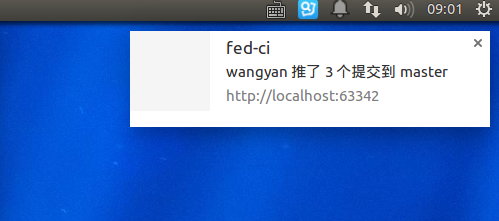

# gitlab-webhook-receiver
Out of the box webhook receiver for gitlab and show webhook activities using browser notifications.


## Usage

**Step 1** Start the server `npm start`, or you can specify custom port like this `PORT=3001 npm start`

**Step 2** Register the webhook server in gitlab project settings

**Step 3** Put the following script into any website you want to receive notifications

```html
<script type="text/javascript" src="http://HOST:PORT/"></script>
```

## Reference
Websocket http://www.w3.org/TR/websockets/
Notification http://www.w3.org/TR/notifications/
Webhook http://doc.gitlab.com/ce/web_hooks/web_hooks.html

## Quick Start

If you don't want to clone the code,you can use following two methods to start a server

1\. Docker

`sudo docker run -p 3001:3001 wyvernnot/gitlab-webhook-receiver`

2\. PM2

`pm2 install gitlab-webhook-receiver`

## TODO List

1\. I18N

2\. Github support